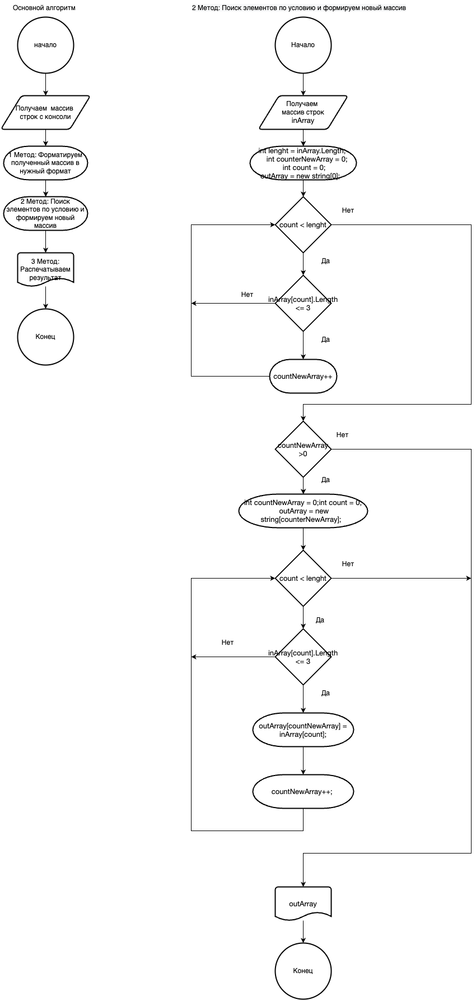

# Задача
Написать программу которая из имеющегося массива формирует массив из строк, длина которых меньше либо равна 3 символа. Первоначальный массив можно ввести с клавиатуры, либо задать на старте алгоритма. При решении не рекомендуется пользоваться коллекциями, лучше обойтись исключительно массивами

Примеры: ["hello","2","world",":-)"] -> ["2",":-)"]

## Алгоритм решения

## Описание работы программы:
1. Запрашиваем в нужном формате и получаем данные из консоли и преобразовываем их в нужный формат этим занимается метод FillMyArray() и SubArrayString() убирает []. Так как из консоли мы получаем строку, то ее нужно преобразовать в массив из строк испольуя разделителем запятую
2. Второй метод TestLineArray() - получает массив строк и на первом этапе считает количество элементов массива которые больше либо равны 3 символам. На втором этапе мы создаем новый результирующий массив размером который получили на первом этапе, и заполняем результирующий массив из исходного массива. Так же функцией SubArrayString() убираем кавычки ", чтобы правильно посчитать количество символов в строке, так как в таком формате может прийти строка из консоли.
3. Третий метод PrintStringArray() распечатывает результирующий массив 
4. Четвертый метод SubArrayString() который проверяет есть ли в строке [] или "" и убирает их в начале и в конце